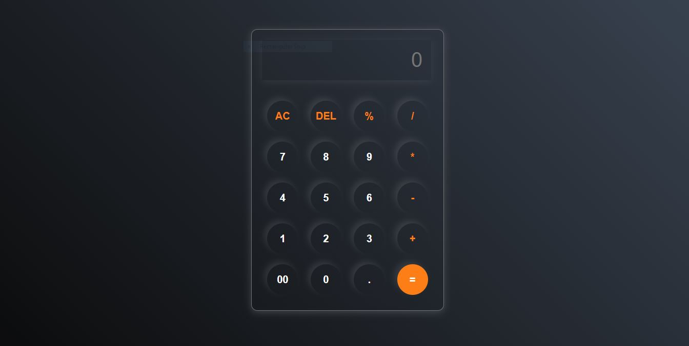

# Calculator

## Description

This is a simple and responsive calculator built using HTML, CSS, and JavaScript. It performs basic arithmetic operations such as addition, subtraction, multiplication, and division.

## Features

- Basic arithmetic operations: addition, subtraction, multiplication, and division.
- Clear button to reset the calculator.
- Responsive design for different screen sizes.

## Technologies Used

- **HTML**: Structure of the calculator.
- **CSS**: Styling of the calculator.
- **JavaScript**: Functionality of the calculator.

## Screenshots

## Contact
**Name:** Pradip Kumar Madheshiya  
**Email:** prdpmadheshiya@gmail.com
